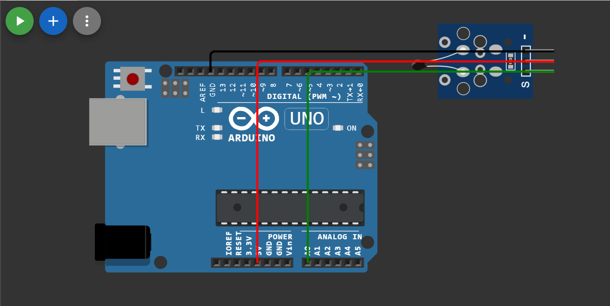
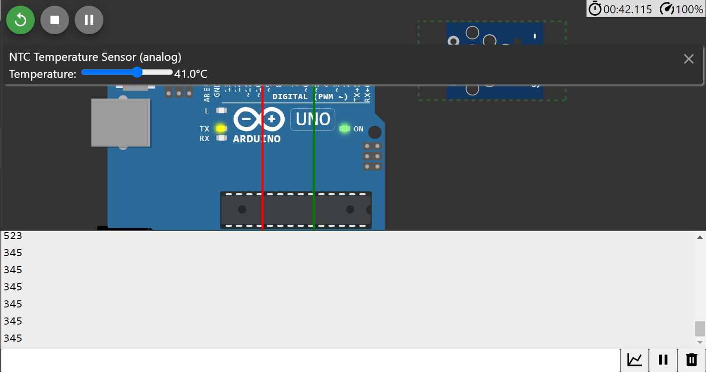

# Descrição do Arduino Uno

## Manual do componente

Referente ao hardware do Arduino Uno, ele possui diversos componentes, entre os quais podemos citar:

- **Porta USB**: Este componente permite a comunicação da placa com o código escrito pelo programador, ou seja, permite carregar o código do computador para a placa, bem como estabelecer uma comunicação serial entre a placa e o computador.

- **Botão de Reset**: Este botão permite reiniciar um programa. Ou seja, se há um código em execução na placa, esse botão permite que o processo seja reiniciado.

- **Microcontrolador ATmega328P**: Esta é a parte mais essencial da placa, responsável por controlar os pinos presentes no Arduino e executar o código. Além disso, o microcontrolador tem uma arquitetura de Harvard, ou seja, com duas memórias separadas para funções diferentes, uma para memória de programa e a segunda para dados. A arquitetura de Harvard impede que o programa seja modificado durante a execução, aumentando a segurança contra situações de sobrescrita.

- **Portas Digitais (Digital I/O)**: Existem 14 pinos digitais incorporados na placa, usados para conectar componentes, como LEDs, através de fios. Portanto, esses pinos podem ser configurados para entrada e saída digitais.

- **LEDs**: O Arduino já contém LEDs em sua placa, que auxiliam na indicação do status do código em execução, bem como em questões de comunicação e funcionamento da placa.

- **Conectores ICSP**: Existem dois conectores ICSP na placa do Arduino Uno, um é o Atmega 16U e o outro é o ATMega328P. Eles são usados para programar diretamente o microcontrolador usando um programador externo.

- **Regulador de Tensão**: Esse regulador permite que o Arduino receba energia de uma fonte de alimentação e a estabiliza, mantendo-a em um nível constante. O Arduino contém dois reguladores, um de 5V e outro de 3.3V.

- **Portas Analógicas**: Essas portas permitem a leitura de sinais analógicos e podem ser usadas tanto para entrada quanto para saída.

- **Amplificador de Baixa Potência**: O Arduino Uno contém o LM358, que serve principalmente como um amplificador, mas também pode funcionar como um comparador de tensão.

- **PolyFuse**: Um mecanismo de segurança usado como proteção em caso de sobrecarga. Ele funciona como um reajustador de proteção.

- **Resonador de 16MHz**: Um cristal usado principalmente para manter o tempo e estabilizar as operações na placa.

- **DC Barrel Jack**: Usado como entrada de alimentação na placa. É um mecanismo de fácil utilização e a corrente que passa por ele é corrente contínua.

## Interfaces de Comunicação do Arduino

Na perspectiva de software, o Arduino possui o seguinte mecanismo:

- **IDE Arduino**: Uma IDE (ambiente de desenvolvimento integrado) que permite escrever código e, quando concluído, transmitir essas informações através de um cabo para a porta USB da placa.

Na perspectiva de hardware:

- **Entrada e Saída Analógica e Digital**: O Arduino permite essas duas modalidades, que podem ser usadas para conectar componentes como LEDs para leituras digitais e sensores de luz para leituras analógicas.

- **Porta USB**: Permite a comunicação entre o computador com o código e a placa.

- **SPI**: A placa pode se comunicar com outros dispositivos que usam o protocolo SPI, como cartões SD.

- **UART**: Outra interface que usa os pinos 0 e 1 para permitir a comunicação com outros dispositivos compatíveis com UART.

- **I2C**: Usado para conexão e comunicação serial entre dispositivos. Esta conexão utiliza dois pinos, SDA (Data) e SCL (Clock).

## Simulação do Arduino Uno no WOWKI

Para fins de experimentação, foi realizada uma simulação na plataforma WOWKI, baseada no uso de um sensor de temperatura em conjunto com uma interface de comunicação do Arduino Uno. Os pinos 5V, A0 e GND foram usados para conectar o sensor de temperatura. A saída foi exibida no monitor, mostrando a temperatura indicada pelo sensor.

O código-fonte está disponível no arquivo src/sketch.ino.

