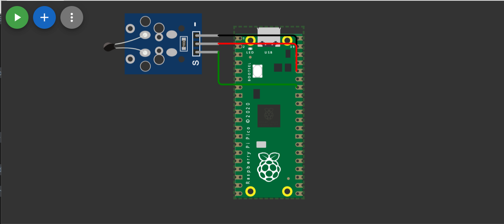
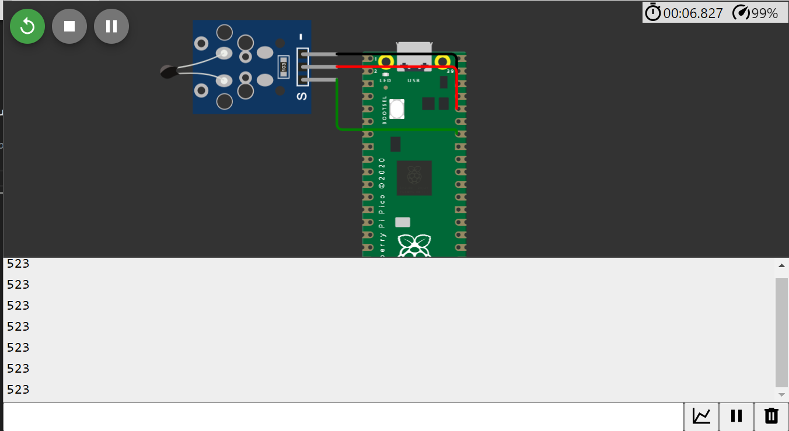

# Descrição dos Componentes do Raspberry Pi Pico

O Raspberry Pi Pico é uma placa microcontroladora repleta de componentes essenciais. Abaixo, destacamos cada um deles:

- **Porta micro-USB**: Esta porta permite a comunicação com o computador, serve como interface serial e pode ser usada para alimentar a placa.

- **Botão de Reset**: Esse botão possibilita o reinício de programas em execução na placa, oferecendo uma maneira prática de recomeçar o processo.

- **Microcontrolador RP2040**: O cérebro do Raspberry Pi Pico, o microcontrolador RP2040, é um poderoso chip com um processador dual-core ARM Cortex-M0+ de 32 bits. Ele executa as operações projetadas pelo código embutido na placa.

- **Portas Digitais (GPIO - General-Purpose Input/Output)**: A placa possui 20 pinos digitais GPIO que permitem conexões com componentes como LEDs e outros dispositivos através de fios. Esses pinos podem ser configurados como entradas ou saídas digitais.

- **Outras Portas**: Além das portas digitais, há três pinos de tensão 3.3V GPIO e mais três pinos GND (terra) GPIO para alimentação e referência de terra.

- **LEDs**: A placa Raspberry Pi Pico possui LEDs incorporados que auxiliam na indicação do status do código em execução, bem como na comunicação e funcionamento da placa.

- **Memória Flash**: Seguindo a arquitetura Harvard, a memória flash é usada para armazenar o código a ser executado na placa. Isso permite a persistência do programa mesmo após desligar e reiniciar a placa.

## Interfaces de Comunicação do Raspberry Pi Pico

Em termos de hardware, o Raspberry Pi Pico oferece diversas opções de comunicação:

- **Entrada e Saída Digital**: O Pico suporta entradas e saídas digitais, sendo útil para conectar componentes como LEDs e realizar leituras digitais.

- **Porta micro-USB**: Essa porta facilita a comunicação com o computador, permitindo transferência de código e fornecendo energia à placa.

- **SPI (Serial Peripheral Interface)**: O Pico possui duas interfaces SPI, que viabilizam a comunicação serial com dispositivos como displays e sensores.

- **UART (Universal Asynchronous Receiver-Transmitter)**: O Pico inclui duas portas UART para comunicação serial com outros dispositivos, como microcontroladores e módulos de comunicação.

- **I2C (Inter-Integrated Circuit)**: O Raspberry Pi Pico oferece duas interfaces I2C para comunicação serial, permitindo conexão com dispositivos compatíveis com I2C.

- **ADC (Conversor Analógico-Digital)**: Três ADCs de 12 bits estão disponíveis para converter dados analógicos em dados digitais, tornando-os ideais para sensores que fornecem informações analógicas, como sensores de temperatura.

- **Canais PWM Controláveis**: O Pico oferece 16 canais PWM, que possibilitam a criação de sinais PWM. Isso é útil para controlar a intensidade de dispositivos, como LEDs, permitindo ajustes de brilho ou velocidade.

## Simulação do Raspberry Pi Pico no WOKWI

Para fins de experimentação, foi realizada uma simulação na plataforma WOKWI, baseada no uso de um sensor de temperatura em conjunto com uma interface de comunicação do Raspberry Pi Pico. Os pinos 3V3, GP28 e GND foram usados para conectar o sensor de temperatura. A saída foi exibida no monitor, mostrando a temperatura indicada pelo sensor.

O código-fonte está disponível no arquivo src/sketch.ino.

