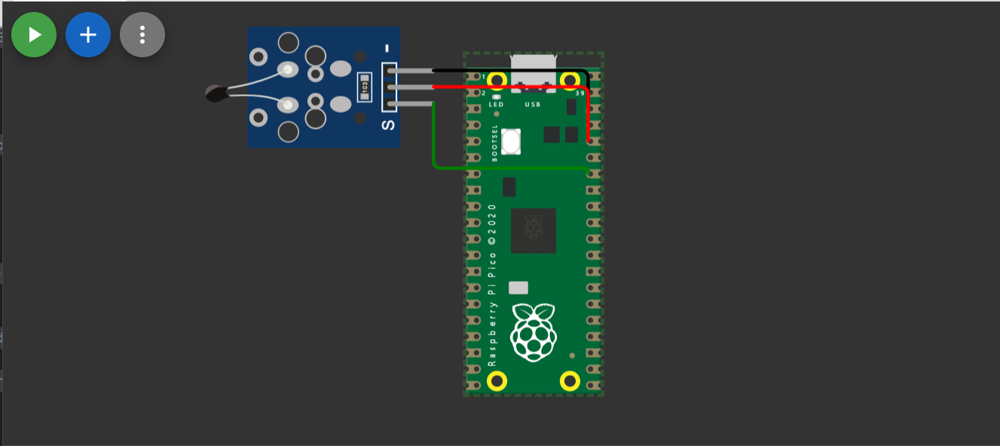
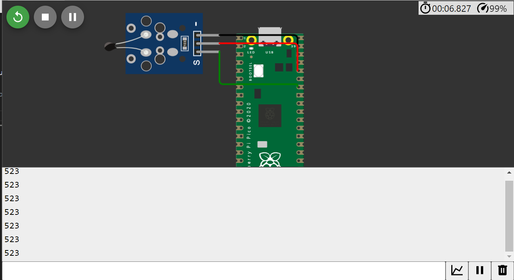
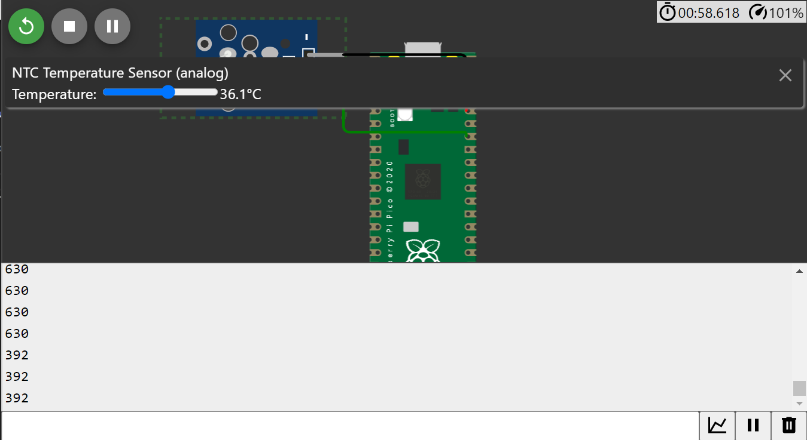

## Simulação no Raspberry Pi Pico na plataforma WOKWI

Realizamos uma experimentação com um código executado no Raspberry Pi Pico, seguindo os seguintes princípios: utilizando um sensor que faz uso de uma interface de comunicação do Raspberry Pi Pico. Para essa experimentação, escolhemos o sensor de temperatura analógico, ou seja, o NTC. Devido à natureza analógica do sensor, realizamos conexões com três pinos: GP28, 3.3V e GND.

Aqui estão os componentes utilizados:

Em seguida, com o programa em execução, é possível ver a saída no terminal, mostrando os valores da temperatura:

Por fim, apresentamos uma variação na temperatura, cujos resultados são exibidos novamente no terminal:

